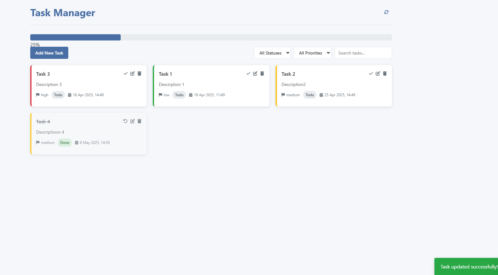

# Task Manager Application

 <!-- Add a screenshot if available -->

## Table of Contents
1. [User Guide](#user-guide)
   - [Getting Started](#getting-started)
   - [Features](#features)
   - [Keyboard Shortcuts](#keyboard-shortcuts)
2. [API Documentation](#api-documentation)
   - [Base URL](#base-url)
   - [Endpoints](#endpoints)
   - [Error Responses](#error-responses)
3. [Development](#development)
   - [Installation](#installation)
   - [Running the Application](#running-the-application)

---

## User Guide

### Getting Started
1. Open the Task Manager in your web browser
2. Start by adding your first task using the "Add New Task" button
3. Organize your tasks using filters and status updates

### Features

#### Adding Tasks
1. Click the "Add New Task" button
2. Fill in task details:
   - **Title** (required)
   - **Description** (optional)
   - **Due date** (optional)
   - **Priority** (low, medium, high)
   - **Status** (todo, in-progress, done)
3. Click "Save Task"

#### Managing Tasks
- **Edit Task**: Click the pencil (✏️) icon on a task card
- **Delete Task**: Click the trash (🗑️) icon on a task card
- **Toggle Status**: Click the check/undo (✓/↩️) icon to mark tasks complete/incomplete

#### Filtering Tasks
Use the controls at the top to:
- Filter by status (All, To Do, In Progress, Done)
- Filter by priority (All, Low, Medium, High)
- Search by text in title or description

#### Progress Tracking
- View your completion progress in the progress bar at the top
- The percentage updates automatically as you complete tasks

---

## API Documentation

### Base URL
`http://localhost:3001/api`

### Endpoints

#### Get All Tasks
`GET /tasks`
- **Response**: 
  ```json
  [
    {
      "id": "string",
      "title": "string",
      "description": "string",
      "dueDate": "ISO8601",
      "priority": "low|medium|high",
      "status": "todo|in-progress|done",
      "createdAt": "ISO8601"
    }
  ]
  ```

#### Create New Task
`POST /tasks`
- **Request Body**:
  ```json
  {
    "title": "string (required, max 100 chars)",
    "description": "string (optional, max 500 chars)",
    "dueDate": "ISO8601 (optional, future date)",
    "priority": "low|medium|high (default: medium)",
    "status": "todo|in-progress|done (default: todo)"
  }
  ```
- **Response**: Returns the created task object

#### Update Task
`PUT /tasks/:id`
- **Parameters**:
    - `id`: Task ID to update
- **Request Body**: Same as create endpoint
- **Response**: Returns the updated task object

#### Delete Task
`DELETE /tasks/:id`
- **Parameters**:
    - `id`: Task ID to delete
- **Response**: 204 No Content

#### Sync All Tasks
`POST /tasks/sync`
- **Request Body**: Array of complete task objects
- **Response**: Returns the synchronized array of tasks

### Error Responses
- `400 Bad Request`: Invalid input data
  ```json
  {
    "errors": [
      {
        "msg": "Title is required",
        "param": "title",
        "location": "body"
      }
    ]
  }
  ```
- `404 Not Found`: Task not found
- `500 Internal Server Error`: Server error
  ```json
  {
    "error": "Internal Server Error",
    "message": "Database connection failed"
  }
  ```

---

## Development

### Installation
1. Clone the repository:
   ```bash
   git clone https://github.com/your-repo/task-manager.git
   ```
2. Install dependencies:
   ```bash
   cd task-manager/api
   npm install
   ```

### Running the Application
1. Start the backend server:
   ```bash
   node mock-server.js
   ```
2. Open the frontend in your browser:
    - Open `index.html` in a web server (e.g., VS Code Live Server)
    - Or use:
      ```bash
      npx serve
      ```
3. The application should be available at `http://localhost:3000`

### Environment Variables
Create a `.env` file in the `api` directory:
```ini
PORT=3001
LOG_LEVEL=debug
```